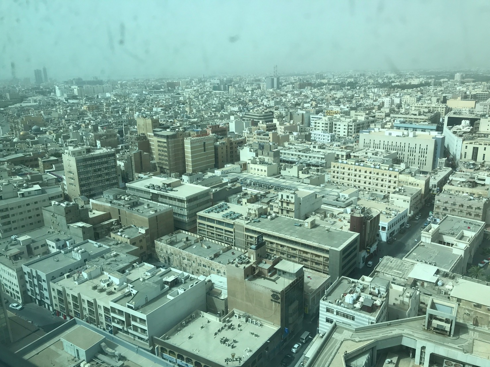

```{r setup, include=FALSE}
knitr::opts_chunk$set(echo = FALSE)
library(tidyverse)
library(ggplot2)
library(gridExtra)
library(grid)
library(lubridate)
library(kableExtra)
library(knitr)
```


## My first experiences in Bahrain


Bahrain was a really unfamiliar country name for me until I received a job opportunity as a project manager,that had to travel to Bahrain in 2018. It has been three years since I went to Bahrain, but I still remember the heat, the desert and the hospitality that Bahrainis has offered me. I didn't get to spend a lot of time roaming around the city nor the country, especially because it was the fasting period when I went.Therefore, I didn't even have the chance to really try the local food there. However, it was one of the most special places that I have ever been.

This is the photo of a lamp shop that I took in the market. I was totally fascinated by the variety and the colour of the glass painting lamps. However, I didn't buy any of those as I was worried if they would break in my suitcase, if i ever have the chance to visit Bharain again, I would allow myself to buy one of those beautiful lamps.


```{r}

```


Bahrain was one of the hottest country that I have ever been to. It was a scorching 43 degrees celcius when I was there. I still remember how hot my glasses frame was, and it was also really sandy!

(I took this picture from the hotel window)


```{r}

```

## How Covid-19 hit Bahrain

The pandemic hit the entire world since the late 2019, even for small countries like Bahrain. However, it was to my surprise that up to today, there are over 66.3% of the population in Bahrain has got fully vaccinated when the whole world was still inadequate of vaccine supplies.

[Read the statistics.](https://www.google.com/search?q=bahrain+vaccination+rate&rlz=1C5CHFA_enTW953TW953&oq=bahrain+vaccination+rate&aqs=chrome..69i57j0i512j0i457i512j0i512l2j69i60l3.4832j0j7&sourceid=chrome&ie=UTF-88)


Note: the data is retrieved from [COVID-19 Data Repository by the Center for Systems Science and Engineering (CSSE) at Johns Hopkins University](https://github.com/CSSEGISandData/COVID-19) which is collected by Johns Hopkins University.


```{r}
data <- read_csv("time_series_covid19_confirmed_global.csv")
```

```{r}
data_tidy <- data %>%
  pivot_longer(cols = `1/22/20`:`8/31/21`, names_to = "dates",
               values_to = "cases") %>%
  mutate(dates = mdy(dates)) %>% 
  mutate_at(vars(dates), funs(year, month, day)) 

bah <- data_tidy %>%
  filter(`Country/Region` == "Bahrain")
```

```{r}
data_tidy <- data_tidy %>%
  mutate(case_yesterday = lag(cases, n = 1),
        daily_increase = cases - case_yesterday )
bah <- bah %>%
  mutate(case_yesterday = lag(cases, n = 1),
        daily_increase = cases - case_yesterday )
```

Comparing the total cumulative cases in the world and Bahrain. We can see that the infection rate has become less steep (i.e. slowing down) in Bahrain after July.

```{r covid_situation_in_Bahrain}
g1 <- data_tidy %>%
  ggplot(aes(x = dates, y = cases))+
  geom_col(col = "#C2714F")+
ggtitle("World situation")
g2 <- bah %>%
ggplot(aes(x = dates, y = cases))+
  geom_col(col = "#C2714F")+
  ggtitle("Bahrain")

grid.arrange(g1, g2, ncol =2)
```
```{r}
bah %>%
  group_by(year, month) %>%
  summarise(`total cases` = sum(cases)) %>%
   knitr::kable(
  caption = "Total cases in Bahrain") %>%
  kable_styling(c("hover", "striped"))
```


The table and the graph below shows the the amount of case increase in regards of the infection cases. It is also consistent to the graph above that the cases has decreased enormously in July, comparing to June when there were about 25,000 cases. The incline rate is likely due to the vaccinations, as Bahrain was one of the first countries to approve Pfizer. This is the reason why Bahrain can achieve such a high vaccination coverage. Up to today, the vaccination approved in Bahrain includes AstraZeneca, Pfizer, Sinopharm and Sputnik [Check out the Ministry of Health of Bahrain](https://healthalert.gov.bh/en/category/vaccine). However, if you search "Bahrain vaccination" in google, you will see many news and scientific reports made by Bahrain and other countries, discussing about the ineffectiveness of Sinopharm, and people had to get booster shots as in getting a third shot, using a different vaccination by Pfizer Inc. and BioNTech SE, which most people only have to take 2 shots per person (Stephen, 2021). [News resourse](https://www.wsj.com/articles/sinopharm-covid-vaccine-seen-as-less-effective-in-bahrain-study-11630150885) 


```{r}
bah %>%
ggplot(aes(x = dates, y = daily_increase))+
  geom_col(col = "#C2714F")+
  ggtitle("cases in Bahrain")
```

```{r table1}
bah %>%
  group_by(year, month) %>%
  summarise(`monthly increase` = sum(daily_increase)) %>%
   knitr::kable(
  caption = "Cases in each month") %>%
  kable_styling(c("hover", "striped"))
```


From the table and the plot above, it is obvious to see that cases in Bahrain has decreased a lot after July, and it has lasted for more than a month. To conclude, we can say that the Covid-19 situation is under control in Bahrain.

Bahrain has always been a special place to me. After writng this post, I just made up my mind to go back to Bahrain again when the Covid-19 is over. Having a such good vaccination example as Bahrain, I believe this day will come soon!


## References

Baptiste Auguie (2017). gridExtra: Miscellaneous Functions for "Grid" Graphics. R package version 2.3. https://CRAN.R-project.org/package=gridExtra

Garrett Grolemund, Hadley Wickham (2011). Dates and Times Made Easy with lubridate. Journal of Statistical
  Software, 40(3), 1-25. URL https://www.jstatsoft.org/v40/i03/.

GitHub - CSSEGISandData/COVID-19: Novel Coronavirus (COVID-19) Cases, provided by JHU CSSE. GitHub. (2021). Retrieved 1 September 2021, from https://github.com/CSSEGISandData/COVID-19.

H. Wickham. ggplot2: Elegant Graphics for Data Analysis. Springer-Verlag New York, 2016.

Hao Zhu (2021). kableExtra: Construct Complex Table with 'kable' and Pipe Syntax. R package version 1.3.4. https://CRAN.R-project.org/package=kableExtra


R Core Team (2021). R: A language and environment for statistical computing. R Foundation for Statistical Computing, Vienna, Austria. URL https://www.R-project.org/.

Stephen, K. (2021). Sinopharm Covid Vaccine Seen as Less Effective in Bahrain Study. The Wall Street Journal. Retrieved 1 September 2021, from https://www.wsj.com/articles/sinopharm-covid-vaccine-seen-as-less-effective-in-bahrain-study-11630150885.

The official website for the latest health developments, Kingdom of Bahrain. Healthalert.gov.bh. (2021). Retrieved 1 September 2021, from https://healthalert.gov.bh/en/category/vaccine.

Wickham et al., (2019). Welcome to the tidyverse. Journal of Open Source Software, 4(43), 1686, https://doi.org/10.21105/joss.01686

Yihui Xie (2021). knitr: A General-Purpose Package for Dynamic Report Generation in R. R package version 1.33.
