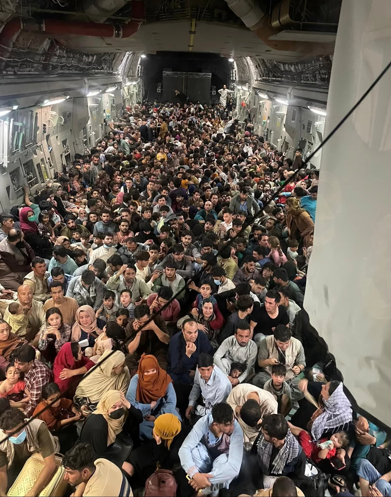

```{r setup, include=FALSE}
knitr::opts_chunk$set(echo = FALSE)
library(tidyverse)
library(ggplot2)
library(gridExtra)
library(grid)
library(lubridate)
library(kableExtra)
library(knitr)
library(DT)
```


When it rains, it pours, but in Afganistan, it's drought. I would say this idiom can describe Afganistan's situation right on point. "The now-absent government at Kabul had declared drought on June 22; half of its 30 million people are below the poverty line while 7,000 COVID-19 deaths have taken place("Taliban take-over: Afghanistan already battling drought, hunger, COVID-19", 2021)

I am writing this post about Covid-19 based on an assignment. Just like what I usually do, pour a cup of coffee and sit in front of my laptop writing down codes and texts. This should have not been a hard task. Yet the more I write the more grief and guilt grows. I even feel cruel when I am writing down the story based on Afhgan's lives without being able to do anything for those innocents, injured children, harmed elders, and the damaged land. However, this is an even more heart-breaking and unfortunate for the fate of the people of Afghanistan. Not only are they suffering from COVID, they also have put up a fight against the Taliban. My heart goes to the people in Afganistan.


```{r}

```
Biden ordered troops to evacuate about 640 Afghans to Qatar from the capital, Kabul, in late August. Obviously, their lives were at risk, and time was so short that the essential protection of COVID by wearing face masks were impossible.

"As the situation in Afghanistan continues to deteriorate rapidly, WHO is extremely concerned over the unfolding safety and humanitarian needs in the country, including risk of disease outbreaks and rise in COVID-19 transmission," said a 17 August WHO update. (Henderson & Sc., 2021)


## The Covid-19 situation in Afganistan

Again, I use the data from John Hopkins University. However, I am highly doubtful for the numbers that I have. Of course I trust John Hopkins, the source is reliable. What I am doubting at, is the collection of the data. When I search "Covid in Afganistan", most of the news I see is how experts worry about the spread of Covid or the lack of health care in Afganistan. However, for people who actually live in Afganistan, might not know which one they should fear more, Covid or Taliban?

## Data decription

The data is retrieved from [COVID-19 Data Repository by the Center for Systems Science and Engineering (CSSE) at Johns Hopkins University](https://github.com/CSSEGISandData/COVID-19) which is collected by Johns Hopkins University.

The dataset in this post contains the number of confirmed cases of coronavirus from 22nd of January in 2020 to 13st of September in 2021. I transferred the data into a long format, so that the dates can be shown in a single column. The dataset also includes variables such as Province, Country/Region and latitude as in lat, longitude as in long.


```{r}
data <- read_csv("time_series_covid19_confirmed_global.csv") 
data_tidy <- data %>%
  pivot_longer(cols = `1/22/20`:`9/13/21`, names_to = "dates",
               values_to = "cases") %>%
  mutate(dates = mdy(dates)) %>% 
  mutate_at(vars(dates), funs(year, month, day)) 

afg <- data_tidy %>%
  filter(`Country/Region` == "Afghanistan")
```


```{r}
data_tidy <- data_tidy %>%
  mutate(case_yesterday = lag(cases, n = 1),
        daily_increase = cases - case_yesterday )
afg <- afg %>%
  mutate(case_yesterday = lag(cases, n = 1),
        daily_increase = cases - case_yesterday )
```


```{r}
afg %>%
ggplot(aes(x = dates, y = daily_increase))+
  geom_col(col = "#138D75")+
  labs(title = "Confirmed Cases in Afganaistan",
    x = "Dates", 
       y = "Daily Increase")+
  theme(text = element_text(color = "white"),
        rect = element_rect(fill = "black"),
        panel.background = element_rect(fill = "black"),
        axis.text = element_text(color = "white"))
```
The confirmed cases in Afganiastan is reaching a peak high as shown above during July. According to multiple news reports,the reasons are, the most serious drought happened during 2021 in June, NGOs and health organizations are evacuating out of Afganiastan due to the takeover of the Taliban. Therefore, the people fled the country in a rush, and with the scarcity of natural resources and good health environment. People couldn't care more about wearing face masks during the flee. Therefore, leading to the rising numbers of COVID infections. 

```{r}
death <- read_csv("time_series_covid19_deaths_global.csv") 
death_tidy <- death %>%
  pivot_longer(cols = `1/22/20`:`9/13/21`, names_to = "dates",
               values_to = "cases") %>%
  mutate(dates = mdy(dates)) %>% 
  mutate_at(vars(dates), funs(year, month, day)) 

death_tidy <- death_tidy %>%
  mutate(case_yesterday = lag(cases, n = 1),
        daily_increase = cases - case_yesterday )

afg_death <- death_tidy %>%
  filter(`Country/Region` == "Afghanistan")


afg_death <- afg_death %>%
  mutate(case_yesterday = lag(cases, n = 1),
        daily_increase = cases - case_yesterday )
```

```{r}
afg_death %>%
ggplot(aes(x = dates, y = daily_increase))+
  geom_col(col = "#138D75")+
  labs(title = "Death Cases in Afganaistan",
    x = "Dates", 
       y = "Daily Increase") +
  theme(text = element_text(color = "white"),
        rect = element_rect(fill = "black"),
        panel.background = element_rect(fill = "black"),
        axis.text = element_text(color = "white"))
```


The death cases in Afganiastan is relatively low comparing to the infection cases, which is highly suspicious and rare. As I mentioned above that health kits and face masks are scarce, I decided to do a deeper search on the death cases, and to my surprise, health officials are being gunned down and also faced life threats because of the Taliban. I would suggest that, this is the reason that lies behind the low death rate, because the government is not running the country, and so the numbers reported above is way lower than the actual death rate. Even though the WHO promised to stay and help out with essentials of COVID supplies. The truth is, it's still not enough to save Afghans' lives. 


I first mentioned that this is an assignment about Covid. However, I cannot ignore the fact that Afghans' lives are in significant danger because of Taliban.


## References
Henderson, E., & Sc., B. (2021). Experts fear rapid spread of COVID-19 in Afghanistan given Taliban's hostility to vaccinations. Retrieved 15 September 2021, from https://www.news-medical.net/news/20210820/Experts-fear-rapid-spread-of-COVID-19-in-Afghanistan-given-Talibans-hostility-to-vaccinations.aspx

Taliban take-over: Afghanistan already battling drought, hunger, COVID-19. (2021). Retrieved 15 September 2021, from https://www.downtoearth.org.in/news/governance/taliban-take-over-afghanistan-already-battling-drought-hunger-covid-19-78475

